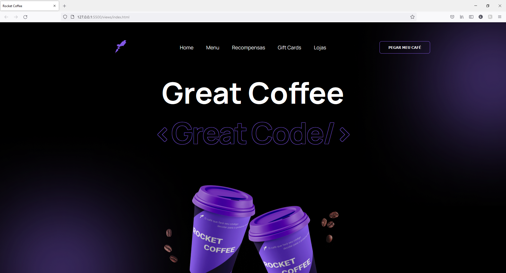
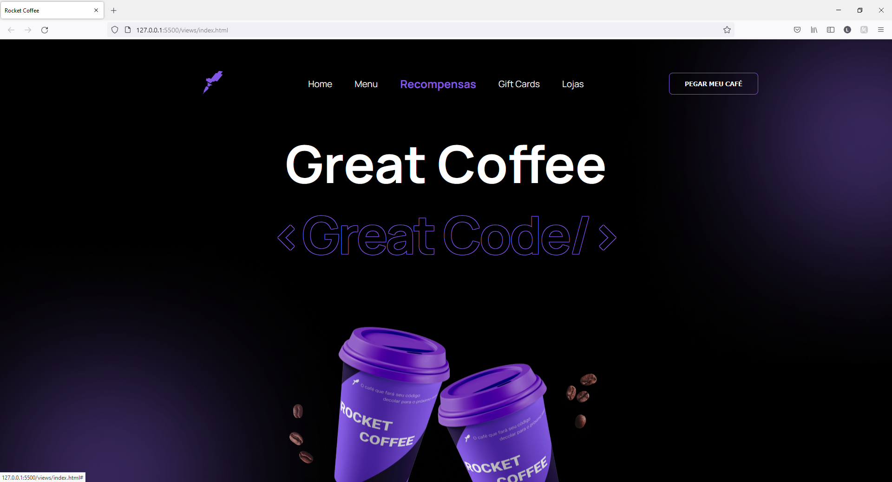
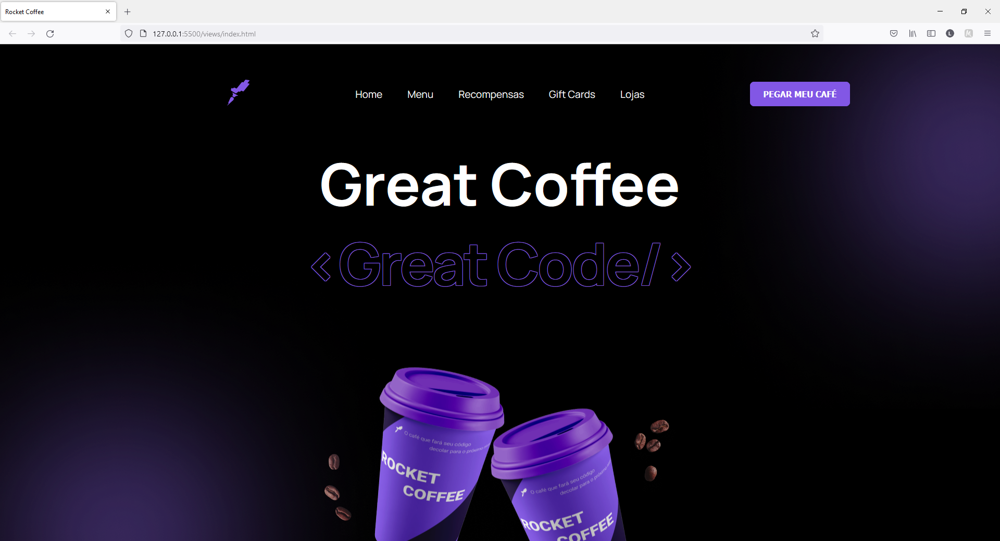
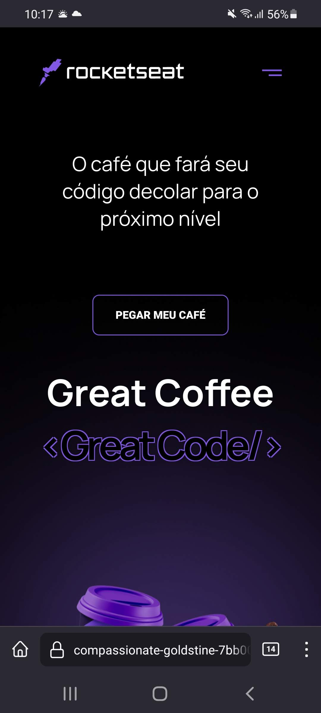
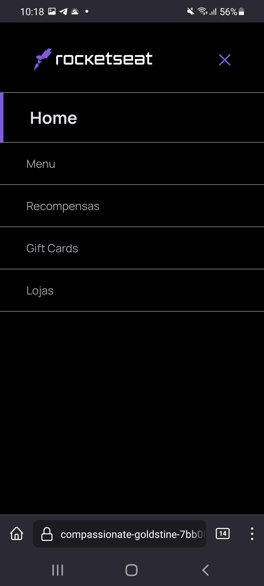

# Rocketcoffee

☕ - Rocketcoffee é um desafio do curso Discover da [Rocketseat](https://rocketseat.com.br) que consiste em criar uma homepage de marca de café, responsiva, a partir de um layout do Figma.

<h1 align="center">
  
</h1>

<h1 align="center">
  
</h1>

<h1 align="center">
  
</h1>

<h1 align="center">
  
</h1>

<h1 align="center">
  
</h1>

## License
[MIT](https://choosealicense.com/licenses/mit/)